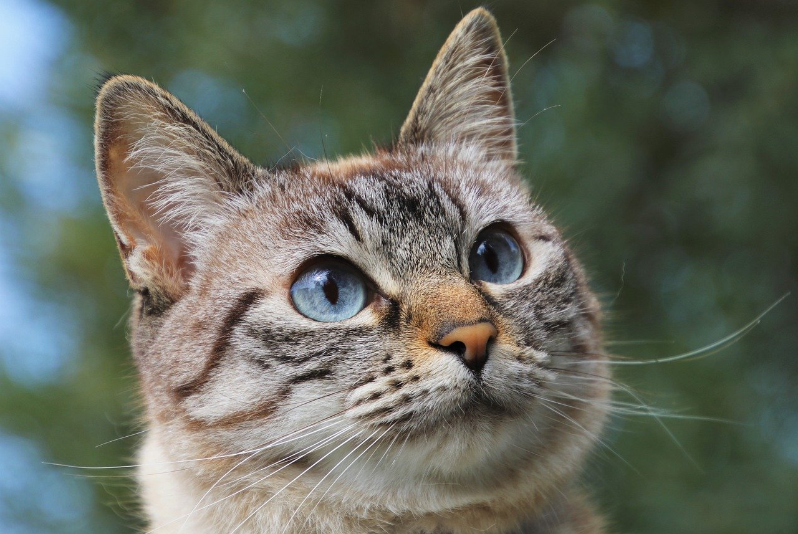
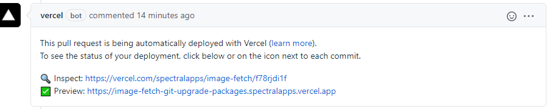

## Project Description

This React App fetch **Pixabay** api information then displays a gallery of images with Author's name and number of total downloads

- ### 🤩 sweet images updated daily

- ### ❓ cars, cats, backgrounds, search for _anything_

## _https://image-fetch.vercel.app/_




> Users can search images and choose image colors

> Image type (Photo/Vector/Illustration), limit the results per page (max 20)

> Download any Image or save them to local /gallery

### React Features:

```rb
Hooks: useState, useEffect, useRef, useContext


-> Redux # state management

-> React lazy # code splitting

-> Suspense # useful loading states

-> Vercel serverless # api

-> My Custom react hooks: useQuery, useParams, useScroll, useLocalStorage, and more...
```

### Style:

```rb
🔷 Bootstrap

💅 Styled components (custom css)

📱  Responsive Web design
```

#### Additional packages:

[Axios](https://github.com/axios/axios): Promise based HTTP client

[Reactstrap](https://reactstrap.github.io/): Bootstrap React components

[React-router](https://reactrouter.com/): Dynamic client-side routes

[Dot env](https://www.npmjs.com/package/dotenv): Environment variables

## Remote preview:

Any pull request will trigger a build

**vercel bot** will give a preview url after it's built (should take 10s - 20s)



> no further configuration or api keys required

## Local testing:

#### rename [.env.example](.env.example) to **.env** and apply

```js
REACT_APP_API_KEY = 'your pixabay api key'; // (dev)
REACT_APP_IMGBB_API_KEY = 'your imgbb api key'; // (dev)
```

get your api keys here:

- https://pixabay.com/api/docs/
- https://api.imgbb.com/

<hr>

> **[Pixabay](https://pixabay.com/) is a free public domain image repository (CC0)**

<!-- > used for getting images -->

> **[IMGBB](https://imgbb.com/) is a free image host**

<!-- >used for saving in /gallery page -->

<!-- _Related project: [spectralapps/image-crop](https://github.com/spectralapps/image-crop)_ -->
